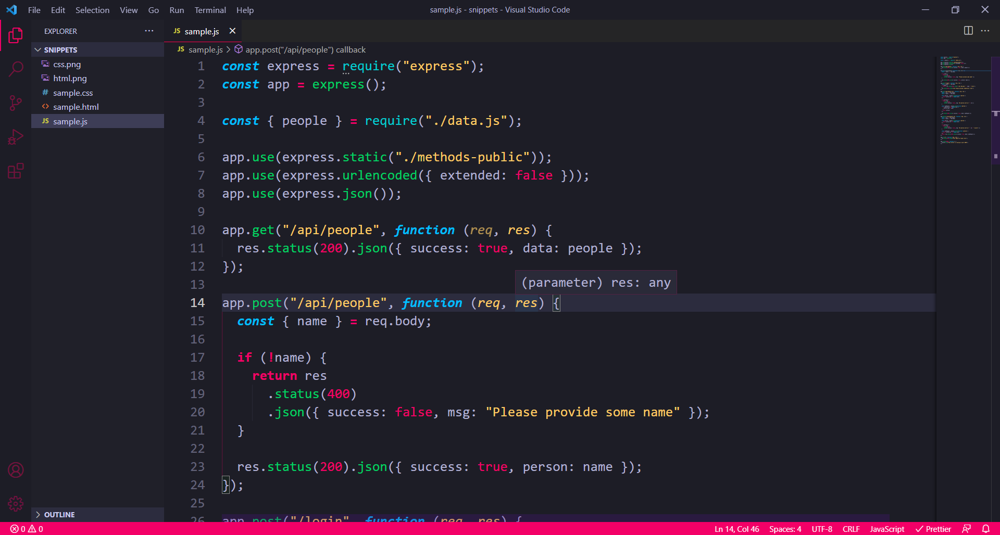
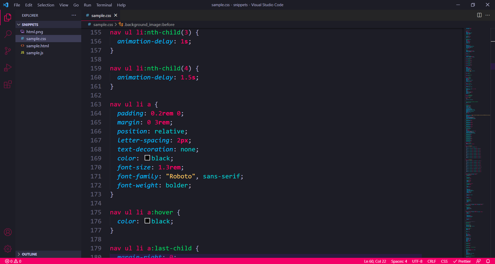

# Blush - VS Code Theme

This theme uses a huge pallete of bright colors which includes pink, blue, green and many more!!

## Getting started

You can install this theme through the [Visual Studio Code Marketplace](https://marketplace.visualstudio.com/).

## Installation

Launch _Quick Open_:

- [Linux](https://code.visualstudio.com/shortcuts/keyboard-shortcuts-linux.pdf) Ctrl+P
- [macOS](https://code.visualstudio.com/shortcuts/keyboard-shortcuts-macos.pdf) ⌘P
- [Windows](https://code.visualstudio.com/shortcuts/keyboard-shortcuts-windows.pdf) Ctrl+P

Paste the following command and press Enter:

```
  ext install blush
```
**Activate theme**

Launch _Quick Open_:

- [Linux](https://code.visualstudio.com/shortcuts/keyboard-shortcuts-linux.pdf) Ctrl + Shift + P
- [macOS](https://code.visualstudio.com/shortcuts/keyboard-shortcuts-macos.pdf) ⌘ + Shift + P
- [Windows](https://code.visualstudio.com/shortcuts/keyboard-shortcuts-windows.pdf) Ctrl + Shift + P

Type theme, choose Preferences: Color Theme, and select Blush theme.

## Screenshots

**JavaScript**


**CSS**


  

## Contributing

Contributions are always welcome!

You can share your ideas down below -

### https://github.com/Prabodhan29/vscode-theme-blush

## **Enjoy!!**
